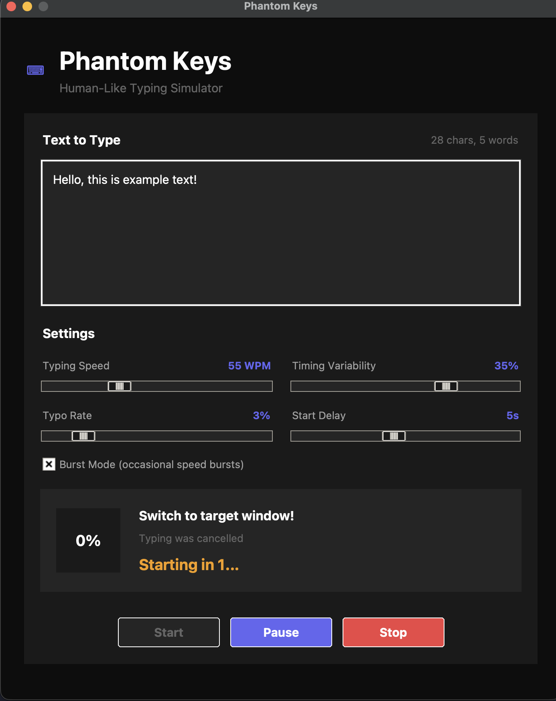

# Phantom Keys

A human-like typing simulator that makes automated text input indistinguishable from real typing. Originally designed to make Google Docs version history show natural, gradual typing progression instead of copy-paste operations.


<p align="center">
  
</p>

## What is Phantom Keys?

When you paste text into Google Docs, the version history shows a single "paste" event. This can be problematic in academic or professional settings where document history is reviewed. Phantom Keys solves this by typing out your text character-by-character with realistic human-like patterns, making the version history appear as if the text was manually typed.

### Key Features

- **Realistic Typing Simulation**: Variable timing between keystrokes that mimics natural human typing patterns
- **Keyboard-Aware Typos**: Generates realistic typos based on QWERTY keyboard layout (hitting neighboring keys) and automatically corrects them
- **Fatigue Simulation**: Typing speed gradually decreases over longer texts, just like a real person
- **Burst Mode**: Occasional speed bursts followed by slower periods, mimicking natural typing rhythm
- **Paragraph Handling**: Natural pauses at paragraph breaks, simulating thinking time
- **Configurable Settings**: Adjust WPM, typo rate, timing variability, and start delay
- **Modern Dark UI**: Clean, intuitive interface with real-time progress tracking

## Installation

### Prerequisites

- Python 3.7 or higher
- pip (Python package manager)

### Quick Setup

1. Clone the repository:

```bash
git clone https://github.com/NPX2218/phantom-keys.git
cd phantom-keys
```

2. Run the setup script:

**macOS/Linux:**

```bash
source setup.sh
```

**Windows:**

```bash
setup.bat
```

### Manual Setup

1. Create a virtual environment:

```bash
python3 -m venv venv
```

2. Activate the virtual environment:

**macOS/Linux:**

```bash
source venv/bin/activate
```

**Windows:**

```bash
venv\Scripts\activate
```

3. Install dependencies:

```bash
pip3 install pyautogui
```

## Usage

1. Start the application:

```bash
python main.py
```

2. Paste or type your text into the text area

3. Adjust settings if needed:

   - **Typing Speed**: Words per minute (default: 55 WPM)
   - **Typo Rate**: Percentage of characters that will have typos (default: 3%)
   - **Timing Variability**: How much the typing speed varies (default: 35%)
   - **Start Delay**: Seconds before typing begins (default: 5s)
   - **Burst Mode**: Enable occasional speed bursts (default: on)

4. Click "Start" and quickly switch to your target application (e.g., Google Docs)

5. Watch as your text is typed out naturally

### Tips for Best Results

- Use the default settings for the most realistic output
- Keep typo rate between 2-5% for natural-looking mistakes
- The 5-second delay gives you time to click into your target document
- For longer texts, the fatigue simulation will automatically slow down typing

## How It Works

### Typing Engine

The core typing engine simulates human behavior through several mechanisms:

1. **Base Timing**: Calculates delay between keystrokes based on target WPM
2. **Character Complexity**: Uppercase letters and special characters take slightly longer
3. **Random Variability**: Each keystroke has randomized timing within a configurable range
4. **Thinking Pauses**: Occasional longer pauses simulate momentary hesitation
5. **Word Boundaries**: Natural pauses between words
6. **Paragraph Breaks**: Longer pauses at newlines, simulating thought collection

### Typo Generation

Typos are generated using a QWERTY keyboard neighbor map. When a typo occurs:

1. A neighboring key is "pressed" instead of the correct one
2. A brief pause simulates noticing the mistake
3. Backspace removes the error
4. The correct character is typed

This creates realistic error patterns in document history.

## Configuration

### Default Settings (Optimized for Google Docs)

| Setting            | Default   | Description                   |
| ------------------ | --------- | ----------------------------- |
| Typing Speed       | 55 WPM    | Average human typing speed    |
| Typo Rate          | 3%        | Subtle but natural error rate |
| Timing Variability | 35%       | Human-like inconsistency      |
| Start Delay        | 5 seconds | Time to switch windows        |
| Burst Mode         | Enabled   | Occasional speed variations   |

### Customization

All settings can be adjusted via the GUI sliders before starting a typing session.

## Project Structure

```
phantom-keys/
├── main.py              # Application entry point
├── setup.sh             # macOS/Linux setup script
├── setup.bat            # Windows setup script
├── README.md            # This file
├── LICENSE              # MIT License
├── preview.png          # Application screenshot
└── venv/                # Virtual environment (created on setup)
```

## Requirements

- **Python**: 3.7+
- **pyautogui**: For simulating keyboard input
- **tkinter**: For the GUI (included with Python)

## Platform Notes

### macOS

You may need to grant accessibility permissions to your terminal or Python:

1. Go to System Preferences > Security & Privacy > Privacy > Accessibility
2. Add your terminal application (Terminal, iTerm2, etc.)

### Linux

On some distributions, you may need to install tkinter separately:

```bash
# Ubuntu/Debian
sudo apt install python3-tk

# Fedora
sudo dnf install python3-tkinter

# Arch
sudo pacman -S tk
```

### Windows

No additional setup required. Ensure Python is added to PATH during installation.

## Contributing

Contributions are welcome! Please feel free to submit a Pull Request. For major changes, please open an issue first to discuss what you would like to change.

## License

This project is licensed under the MIT License - see the [LICENSE](LICENSE) file for details.

## Disclaimer

This tool is provided for educational and legitimate productivity purposes. Users are responsible for ensuring their use complies with applicable policies, terms of service, and academic integrity guidelines. The authors do not condone or encourage academic dishonesty or policy violations.

## Author

Neel Bansal

## Acknowledgments

- Built with Python and tkinter
- Keyboard simulation powered by PyAutoGUI
